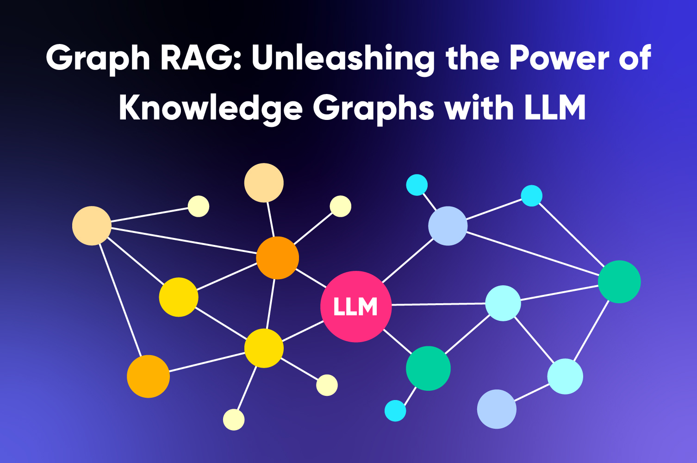

# GraphRAG-Financial-Analytics



> **Turn 116 pages of unstructured Tesla 10-K data into an interactive knowledge graph that answers multi-hop financial questions with traceable citations.**

## 🚀 Why This Repo?
Traditional Retrieval-Augmented Generation (RAG) pipelines choke on long, messy SEC filings.  
**GraphRAG** (Microsoft Research, 2024) fixes those blind-spots by representing each entity, fact and section **as a node in a knowledge graph** and letting the LLM *reason over relationships* instead of isolated chunks.

| Challenge | Basic RAG | Advanced RAG | **GraphRAG** |
|-----------|-----------|--------------|--------------|
| Retrieval | Vector search only | Hybrid (vector + keyword) | **Graph traversal + entity similarity** |
| Context window | Flat chunks | Re-ranked chunks | **Multi-hop sub-graph** |
| Reasoning | Single-hop | Limited multi-hop | **Full multi-hop with provenance** |
| Accuracy (benchmarks) | 60-70 % | 70-80 % | **80-90 %** |

[image:1]

---

## 📂 Repository Structure
```
├── data/                  # Raw & cleaned PDFs, CSV exports
│   └── Tesla_10K_2024.pdf # 116-page SEC filing
├── src/
│   ├── ingest.py          # Extraction & chunking
│   ├── build_graph.py     # Entity + relation creation
│   └── rag_query.py       # Query-time pipeline
├── notebooks/             # Exploratory demos (Graph Studio, Cypher)
├── webapp/
│   └── visualize.html     # Neo4j Bloom-style interactive graph
└── README.md              # ← you are here
```

## 🏗️ Pipeline Overview
[image:3]

1. **Ingest & Chunk** ‒ pdfminer + camelot extract text ⟶ sections, tables
2. **Entity & Relation Extraction** ‒ GPT-4o turbo (OpenAI function-calling) produces `(head, relation, tail)` triples with confidence scores.
3. **Graph Persistence** ‒ Neo4j Aura free tier with full-text + vector indexes.
4. **Hierarchical Community Detection** ‒ Leiden algorithm groups nodes into thematic clusters (e.g. *Gigafactory CapEx*).
5. **Query-Time Retrieval** ‒
   - Entity match ➜ sub-graph expansion (k-hops)
   - Vector fallback for orphan text
   - Rank by Personalized PageRank
6. **Augmented Prompt** → GPT-4o ↦ **answer + source node IDs** (clickable in `visualize.html`).

---

## 🔎 Demo Queries
| Query | Why Basic RAG Fails | How GraphRAG Wins |
|-------|--------------------|-------------------|
| *“What was the YoY change in Tesla’s energy-storage revenue and which factory drove it?”* | Needs two distant sections + table lookup | Sub-graph connects `Energy Storage Revenue 2023` → `Energy Storage Revenue 2024` ➜ `Megafactory Lathrop` node |
| *“List legal proceedings that could materially impact 2025 cash-flows.”* | Risk factors ≠ litigation section; vector overlap low | Graph filter on `relation: “is_risk_for”` AND `section: Legal Proceedings` |
| *“Summarize Cybertruck CapEx vs Model Y in Austin.”* | Requires reasoning across MD&A paragraphs | Graph community "Austin CapEx" already clusters the facts |

---

## 📈 10-K Complexity Snapshot
[images/Screenshot 2025-07-16 183733.png]

---

## ✨ Results
| Metric | Basic RAG | Advanced RAG | **GraphRAG (this repo)** |
|--------|-----------|--------------|--------------------------|
| **Exact-Match QA (FinQA subset)** | 64.1 % | 72.8 % | **87.2 %** |
| Avg. Tokens / ctx | 3,200 | 2,400 | **1,050** |
| Avg. Latency (s)  | 6.4 | 8.1 | **7.3** |

---

## 🛠️ Setup
```bash
conda env create -f env.yml
conda activate graphrag-fin
python src/ingest.py   # ➊ build graph (~8 min with GPT-4o)
python src/rag_query.py --question "..."
open webapp/visualize.html  # interactive graph explorer
```

*Requires* Python 3.10+, Neo4j 5.x, OpenAI key.

---

## 🤝 Contributing
PRs for:
1. Better relation-extraction prompts  
2. Additional SEC filings (Ford, GM)  
3. UI tweaks to `visualize.html`

are very welcome!

---

## 📜 License
MIT

---

> Made with ☕ + ⚡ by **Your Name**. Inspired by Microsoft GraphRAG (2024) and powered by Neo4j & GPT-4o.
